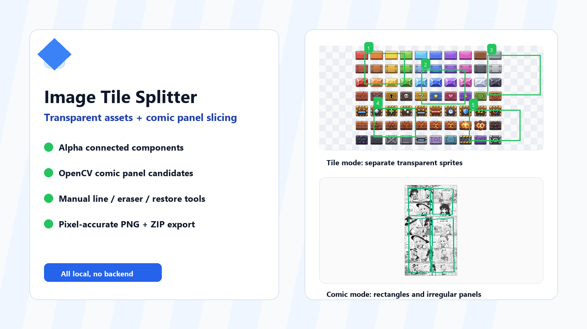
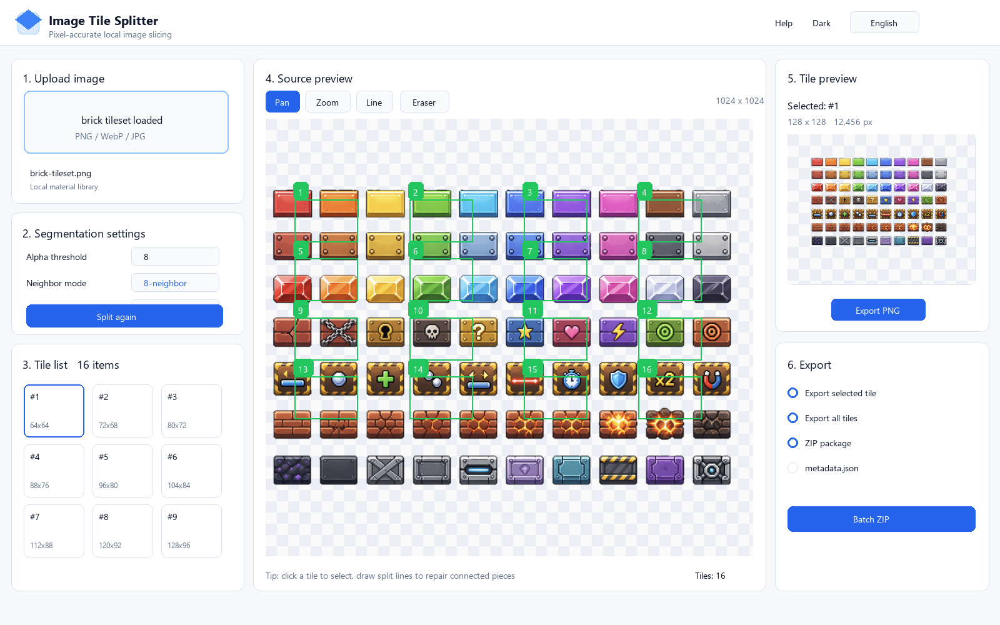
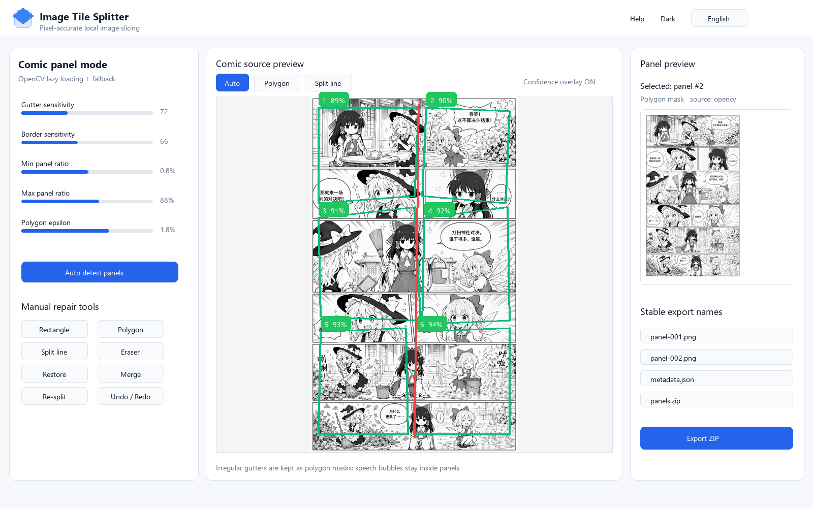

# 用一个纯前端小工具，把透明素材图集和漫画页拆成独立图块

> 封面图建议使用：`00-cover.png`



做游戏素材、漫画分镜或者 AI 生成图整理时，经常会遇到一个很具体但很烦的问题：

一张图里有很多独立元素，想把它们一个个导出来。

如果是透明 PNG 图集，手动裁每一块很机械；如果是整页漫画，漫画格之间有留白、边框、斜切分格，人工拆起来更慢。于是我做了一个纯前端的「图块分离工具」，目标就是：上传图片，本地识别，手动修正，批量导出。

项目特点很直接：

- 不需要后端，图片不会上传到服务器
- 支持 PNG / WebP / JPG
- 透明图块按 alpha 通道自动分离
- 漫画格支持 OpenCV.js 检测和不规则 mask
- 支持手动画线、橡皮擦、恢复画笔、矩形框、多边形框
- 可导出单个 PNG、批量 ZIP 和 metadata.json

## 透明图块：适合游戏素材图集

我先用一张游戏砖块素材图集测试。这个模式主要看 alpha 通道，只要两个图块之间透明且不相连，就会被识别成两个独立 component。



这个模式的核心逻辑是 connected components：

1. 读取 Canvas 的 ImageData
2. 把 `alpha > 阈值` 的像素视为有效像素
3. 用 4 邻域或 8 邻域查找连通区域
4. 给每个图块生成 bounding box、mask、预览图和导出图

这里比较重要的一点是：导出不是简单裁矩形，而是只复制当前图块 mask 内的像素。也就是说，矩形范围里如果还有别的图块，不会被混进去；半透明边缘也会原样保留。

如果两个图块中间有 1px 连接，默认会被视为同一块。这是合理的，因为从像素连通性来说它确实连上了。遇到这种情况，可以用「分割线工具」在连接处画一下，mask 被切断后再重新分割即可。

## 漫画格：适合整页漫画和 AI 生成漫画

漫画格模式更复杂，因为 JPG 或普通漫画页没有透明通道，不能直接靠 alpha 分离。

当前版本的处理思路是：

- 优先懒加载 OpenCV.js
- 检测白色 gutter、黑色边框和近似轮廓
- 对页面边缘连通的白色留白做 flood fill
- 把外部 gutter 视为分隔区，剩余区域作为漫画格 mask
- 支持不规则漫画格，不强制变成矩形



这个设计主要是为了处理斜切分格和不规则分镜。之前如果只用 bounding box，就会把漫画格强制变成矩形；如果只用内容轮廓，又可能把白色对话框误删。现在的策略是：

- 规则矩形格：保留完整矩形 panel
- 不规则格：使用真实 mask 或 polygon
- 白色对话框：只要不是和页面外部 gutter 连通，就会保留在格内

自动检测不可能覆盖所有漫画排版，所以工具里保留了手动修正：

- 画矩形框：快速补一个规则 panel
- 多边形工具：补不规则 panel
- 分割线工具：切开粘连区域
- 合并工具：把误拆的格子重新合并
- 撤销/重做：放心试错

## 导出：PNG、ZIP、metadata 一起处理

右侧预览区可以查看当前选中的图块或漫画格，并直接导出 PNG。需要批量处理时，可以一键打包 ZIP。

metadata.json 会记录每个图块的位置和顺序，例如：

```json
{
  "sourceWidth": 1024,
  "sourceHeight": 1024,
  "items": [
    {
      "id": 1,
      "x": 120,
      "y": 80,
      "width": 128,
      "height": 128,
      "order": 0
    }
  ]
}
```

如果后续要把这些切片导入游戏引擎、漫画排版工具或自己的素材管理系统，这个 metadata 会比较有用。

## 为什么做成纯前端？

因为这类工具经常会处理还没公开的素材、分镜稿或 AI 生成图。纯前端有几个好处：

- 图片只在浏览器本地处理
- 不需要上传素材
- 没有后端部署成本
- GitHub Pages 就能上线
- 断网也可以用本地构建版

像透明通道分割、mask 编辑、PNG 导出、ZIP 打包这些功能，浏览器的 Canvas 和 ImageData 已经足够完成。

## 适用场景

我觉得它比较适合这些工作流：

- 游戏像素素材图集拆分
- 透明贴纸 / 透明图块批量导出
- AI 生成漫画页拆格
- 普通漫画页初步切 panel
- 把分镜稿整理成单格素材
- 给素材生成 metadata，方便后续程序读取

## 当前限制

漫画格自动检测仍然不是 AI 语义分割，它更偏规则图像处理：

- 留白太少、边界很模糊时，需要手动修正
- 复杂跨格人物可能被误判
- 没有明显 gutter 的拼贴图，需要多边形工具辅助
- OpenCV.js 会增加一点静态资源体积，所以采用懒加载

不过对「整页漫画 + 明确留白/边框」这类输入，它已经能减少很多重复裁切工作。

## 小结

这个工具的定位不是替代专业图像编辑软件，而是把一个高频、机械、容易出错的素材整理步骤自动化：

上传图片，自动识别，手动修正，批量导出。

透明图块模式追求像素级准确；漫画格模式追求自动候选 + 手动修正的效率。对于游戏素材和漫画分格整理，这种组合会比单纯手裁快很多。

如果你也经常整理图集、漫画格、AI 生成图，可以试试这个思路：不用复杂后端，纯前端也能做出一个实用的本地工具。
